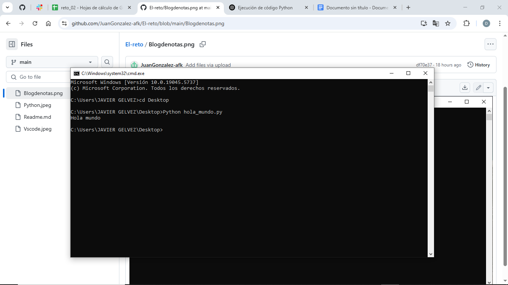
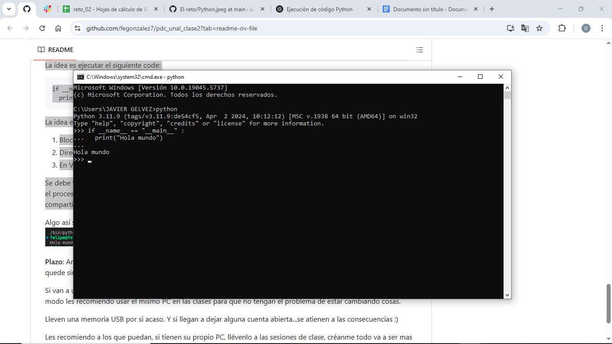
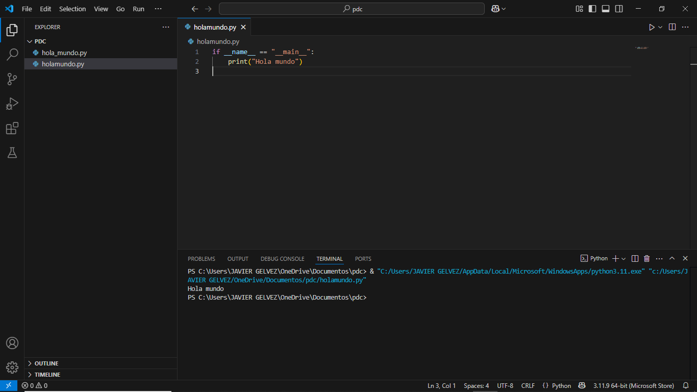

#  Reto 2: Hola Mundo en 3 entornos

Este repositorio muestra cómo ejecutar un simple programa en Python en tres entornos distintos.

##  Código

```python
if __name__ == "__main__":
    print("Hola mundo")
### Capturas de pantalla

#### 1. Bloc de notas + Terminal


#### 2. Intérprete de Python


#### 3. Visual Studio Code

